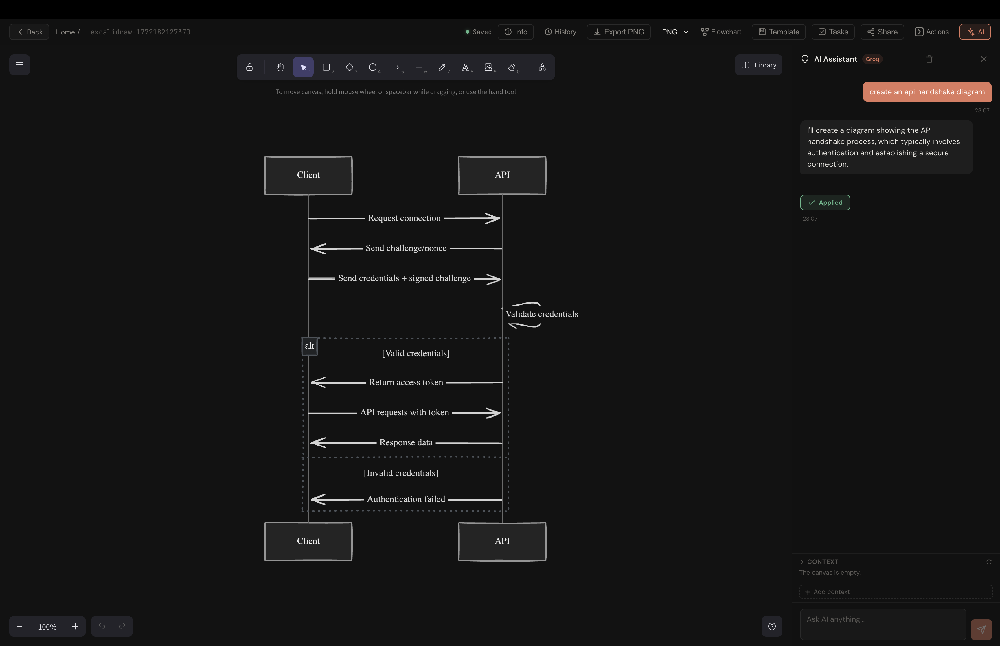
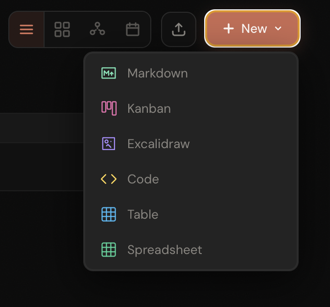
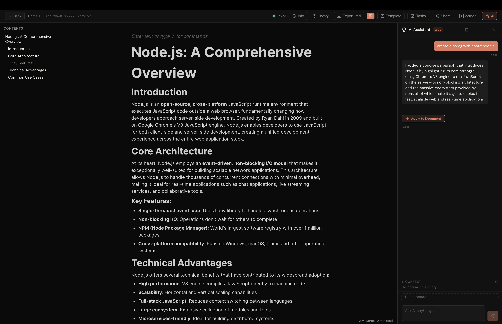
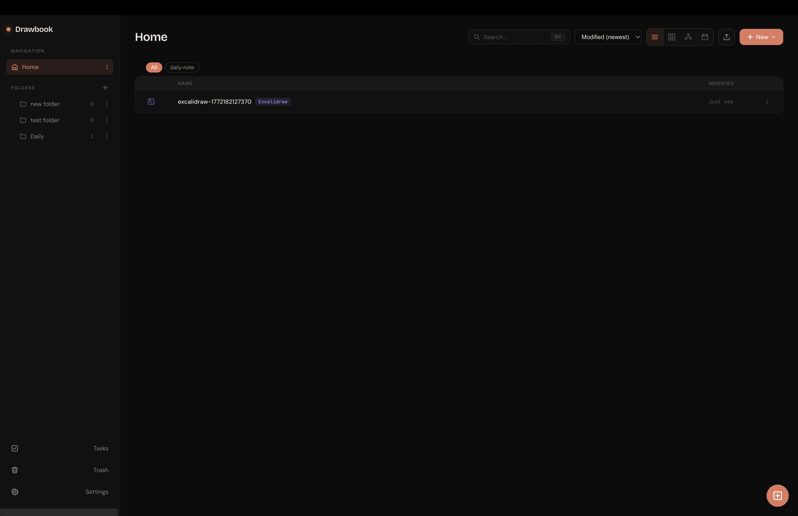
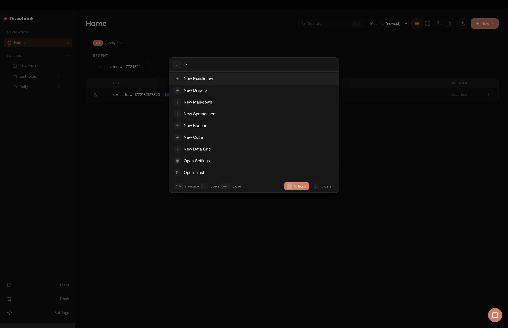
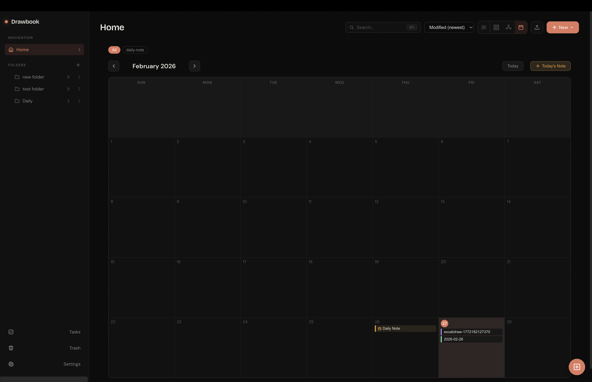
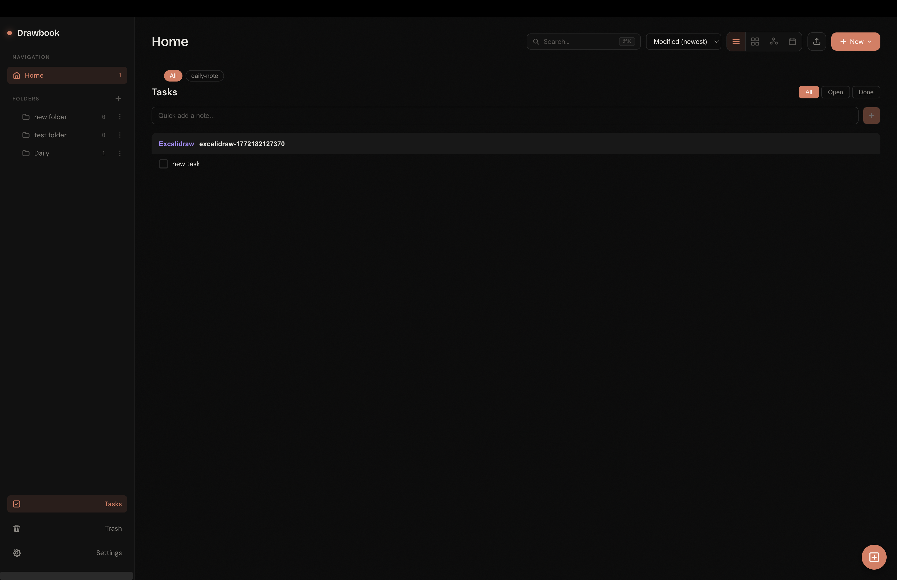
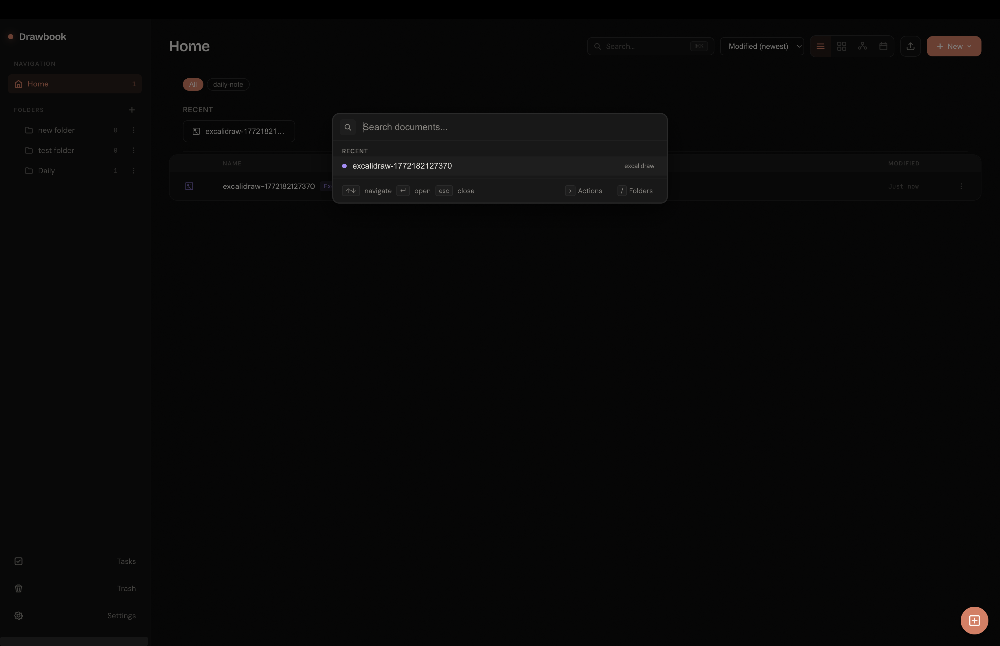
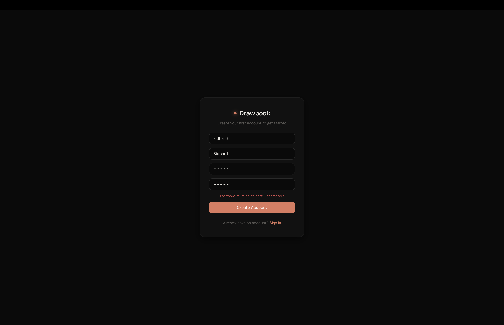
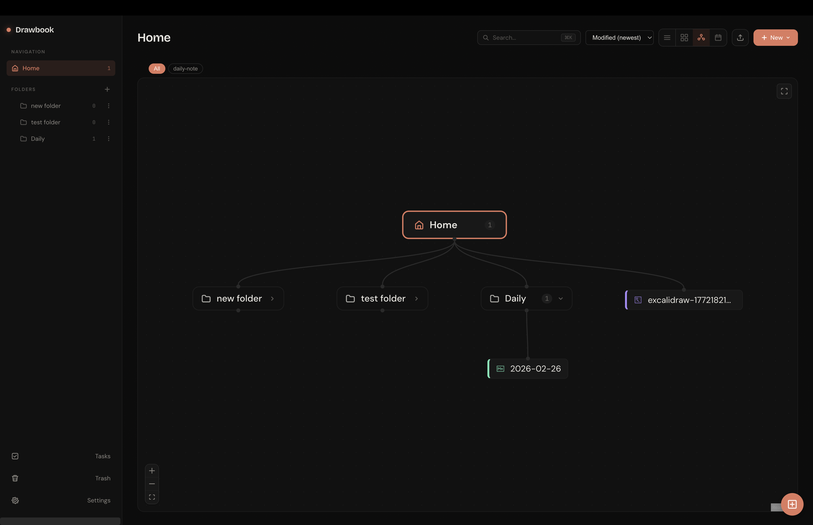

<p align="center">
  
</p>

<h1 align="center">Drawbook</h1>

<p align="center">
  <strong>A self-hosted workspace for drawings, docs, diagrams, and more.</strong><br/>
  One app. Every creative tool you need. Your data stays yours.
</p>

<p align="center">
  <a href="#quick-start">Quick Start</a> &bull;
  <a href="#features">Features</a> &bull;
  <a href="#configuration">Configuration</a>
</p>

---

Drawbook brings together the best open-source editors into a single, self-hosted workspace. Create whiteboards, flowcharts, rich documents, spreadsheets, kanban boards, and code files — all organized in folders, searchable with a command palette, and backed by local storage or any S3-compatible bucket. Share any document by copying its URL.

## Install

### Homebrew (macOS)

```bash
brew tap sidharthmsk/drawbook
brew install --cask drawbook
```

That's it — open Drawbook from your Applications folder.

### Download

Grab the latest `.dmg` from [GitHub Releases](https://github.com/sidharthmsk/drawBookRelease/releases).

> **Note:** The app is not code-signed. If you download the DMG directly, right-click the app and choose **Open** the first time. This is not needed when installing via Homebrew.

---

## Quick Start (Self-Hosted)

### Docker (recommended)

```bash
git clone https://github.com/sidharthmsk/drawBookRelease.git
cd drawBookRelease
docker compose up -d --build
```

Open `http://localhost:3000` and create your account.

### Local Development

```bash
cd app
cp env.example .env        # edit as needed
npm install
npm run dev
```

- Frontend: `http://localhost:5173`
- API / WebSocket: `http://localhost:3000`

### Desktop (Electron) — from source

```bash
cd app
npm install
npm run electron:dev        # dev build + launch
npm run electron:dist       # build .dmg for macOS
```

The packaged app stores data in the OS user-data directory and runs its own local server.

---

## Features

### Integrated Editors

Create any document type from the `+ New` menu or the command palette:

<p align="center">
  
</p>

| Editor | What it does |
|--------|-------------|
| **Excalidraw** | Hand-drawn style diagrams and sketches |
| **Draw.io** | Professional flowcharts and technical diagrams |
| **Markdown** | Rich text editor with table of contents, export to `.md`, and word count |
| **Spreadsheet** | Full spreadsheet editor |
| **Data Grid** | Tabular data editor |
| **Kanban** | Drag-and-drop task boards |
| **Code** | Syntax-highlighted code editor |
| **tldraw** | Infinite canvas whiteboard *(optional, requires license)* |

### AI Assistant

Powered by Groq, the built-in AI assistant works across editors:

- **Generate diagrams from text** — describe what you want and it draws it on the Excalidraw canvas
- **Write and edit documents** — ask AI to draft paragraphs, then apply them to your Markdown doc with one click
- **Chat with context** — the assistant sees your current document and can answer questions about it
- **Make Real** — turn wireframes into working UI prototypes

<table>
  <tr>
    <td width="50%">
      <p align="center"><strong>AI-generated diagram on Excalidraw</strong></p>
      
    </td>
    <td width="50%">
      <p align="center"><strong>AI writing a Markdown document</strong></p>
      
    </td>
  </tr>
</table>

### Dashboard & Organization

- **Folders** — organize documents into nested folders
- **Multiple views** — switch between list, grid, graph, and calendar views
- **Quick search** — fuzzy-find any document instantly with `Cmd+K`
- **Command palette** — create new documents, open settings, jump to trash — all from the keyboard
- **Calendar view** — see documents plotted on a monthly calendar with daily notes
- **Tasks** — lightweight task manager linked to your documents
- **Trash & restore** — deleted documents go to trash before permanent removal

<table>
  <tr>
    <td width="50%">
      <p align="center"><strong>Dashboard</strong></p>
      
    </td>
    <td width="50%">
      <p align="center"><strong>Command Palette</strong></p>
      
    </td>
  </tr>
  <tr>
    <td width="50%">
      <p align="center"><strong>Calendar View</strong></p>
      
    </td>
    <td width="50%">
      <p align="center"><strong>Tasks</strong></p>
      
    </td>
  </tr>
  <tr>
    <td width="50%" colspan="2">
      <p align="center"><strong>Quick Search</strong></p>
      <p align="center"></p>
    </td>
  </tr>
</table>

### Collaboration & Sharing

- **Real-time sync** — open the same URL on two devices and edits sync live via WebSocket
- **Shareable URLs** — every document has a unique `?doc=` URL you can send to anyone
- **Multi-user accounts** — each user gets their own account with registration control

<p align="center">
  
</p>

### Knowledge Graph

- **[[Wiki-links]]** — link documents together with `[[name]]` syntax
- **Link graph** — visualize how your documents connect in an interactive node graph
- **Backlinks** — see which documents reference the current one

<p align="center">
  
</p>

### Storage & Deployment

- **Local storage** — works out of the box with zero config, documents saved as JSON files
- **S3 / MinIO** — persist everything to any S3-compatible bucket
- **Docker-ready** — includes Dockerfile, docker-compose, health checks, and resource limits
- **Desktop app** — runs as a native Electron app on macOS
- **Password protection** — optional shared password or per-user accounts
- **Homebrew** — install the desktop app via `brew install --cask drawbook`

---

## Configuration

Copy `app/env.example` to `app/.env` and adjust:

| Variable | Default | Description |
|----------|---------|-------------|
| `PORT` | `3000` | Server port |
| `DATA_DIR` | `./data` | Local storage directory |
| `APP_PASSWORD` | *(unset)* | Set to enable shared password protection |
| `ENABLE_TLDRAW` | `false` | Enable the tldraw whiteboard (requires a [tldraw license](https://tldraw.dev) for production) |
| `ENABLE_LINKING` | `false` | Enable [[wiki-links]], link graph, and backlinks |
| `ENABLE_REGISTRATION` | `true` | Set to `false` to prevent new sign-ups |
| `STORAGE_BACKEND` | *(auto)* | `local` or `minio` — auto-detects when MinIO vars are present |
| `MINIO_ENDPOINT_URL` | — | Full URL to S3/MinIO endpoint (e.g. `http://minio:9000`) |
| `MINIO_ACCESS_KEY` | — | S3 access key |
| `MINIO_SECRET_KEY` | — | S3 secret key |
| `MINIO_BUCKET` | `drawbook` | Bucket name |
| `MINIO_REGION` | `us-east-1` | Bucket region |
| `MINIO_PREFIX` | *(empty)* | Key prefix inside the bucket |
| `CORS_ORIGINS` | *(open)* | Comma-separated allowed origins |
| `GROQ_API_KEY` | — | For AI features (get key at [console.groq.com](https://console.groq.com)) |
| `TRUST_PROXY` | `false` | Set to `true` behind a reverse proxy for accurate rate limiting |

### Storage Backends

**Local (default):** Documents are stored as JSON files in `DATA_DIR`. Zero setup required.

**MinIO / S3:** Set `STORAGE_BACKEND=minio` (or just provide the MinIO env vars) and the server will persist documents, metadata, and uploaded files to your S3-compatible bucket. The bucket is created automatically if it doesn't exist.

---

## Security Notes

- **Multi-user accounts** with registration control. Disable sign-ups with `ENABLE_REGISTRATION=false` after creating your accounts.
- **CORS is open by default** for ease of self-hosting. Set `CORS_ORIGINS` to restrict it in production.
- Login endpoint is rate-limited (10 attempts per 15 minutes).
- When exposing to the internet, use HTTPS via a reverse proxy with TLS termination.

## Third-Party Licenses

Drawbook's own code is MIT-licensed, but it depends on libraries with different licenses:

| Library | License | Notes |
|---------|---------|-------|
| **tldraw** | [tldraw License](https://github.com/tldraw/tldraw/blob/main/LICENSE.md) | Production use requires a license key from [tldraw.dev](https://tldraw.dev). Dev/personal use is allowed. |
| **Excalidraw** | MIT | |
| **BlockNote** | MPL-2.0 | Modifications to BlockNote source must stay MPL-2.0. |
| **Univer** | Apache-2.0 | Community packages only. |
| **AG Grid** | MIT (Community) | Only the Community Edition is used. |
| **Draw.io** | Apache-2.0 | Embedded via iframe from `embed.diagrams.net`. |
| **PDF.js** | Apache-2.0 | |
| **CodeMirror** | MIT | |

## License

MIT — see [LICENSE](./LICENSE).

This license applies to the Drawbook application code only. Third-party dependencies have their own licenses as described above.
